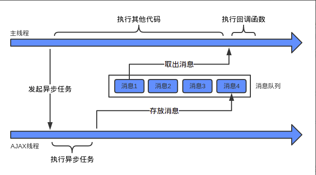
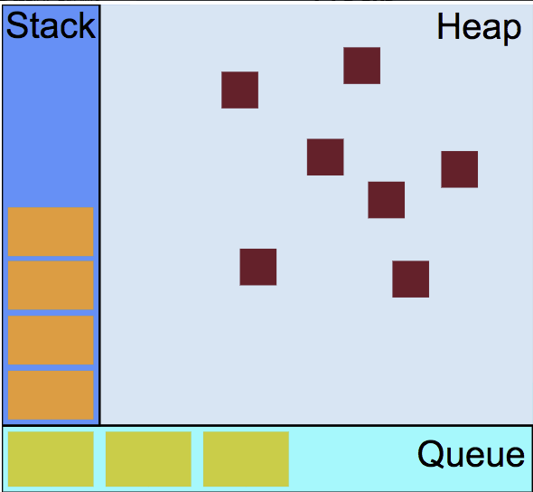

# JS异步

* ## 什么是异步（Asynchronous）？
  
  * ### 同步
    函数返回时，函数调用者立刻能得到返回值，那么函数就是同步的。

    ```JavaScript
      // 0.6061255024402574
      // 函数返回时，获得了结果，得到了一个0-1的随机数
      Math.random()
    ``` 

    同步函数在得到返回值之前，会一直在等待，直到得到结果

  * ### 异步
    
    像读取文件、网络请求这种类型的函数，如果一直在那里等着，会很耗时，这样就会导致你进行一个耗时长的操作，使整个页面都没法干活了。所以这类函数返回时，并不能立即得到结果，这些耗时的操作交给其他线程去执行，保证主线程不会被阻塞，待到操作执行完后，把相应的结果传递给回调函数，通知主线程（执行JavaScript代码的线程执行回调)。

* ## 多线程
  
  JavaScript诞生之初，只是为了处理页面中的用户交互以及操作DOM树，CSS样式树，如果JavaScript是多线程的，那操作这些资源时，就会出现冲突，比如同一个DOM节点，一个线程要删除它，一个线程要修改它，那就不好裁决要执行哪个操作了，为了不增加复杂性，所以JavaScript设计之初就选择了单线程。

  虽然JavaScript是单线程的，但是JavaScript的运行环境——浏览器的内核是多线程的，一个浏览器通常有以下几个常驻的线程：

  * GUI渲染引擎线程：负责页面渲染，当页面发生重绘或者回流时，该线程就会执行，当JS引擎运行期间，GUI渲染线程就不会运行了。
  * JS引擎线程：负责JS的解析和执行
  * 定时触发器线程：执行定时时间，比如setTimeout等
  * 事件触发线程： 处理DOM事件
  * 异步http请求线程： 处理http请求


* ## 消息队列与事件循环
  现在知道了JavaScript是通过自己的主线程与浏览器中的其他线程交互协作实现异步的，其他线程执行完自己的操作得到结果时，会将结果传给回调函数，通知JavaScript主线程执行回调函数。

  

  消息队列和事件循环决定了回调函数何时加入到JavaScript主线程中被执行。

  

  https://developer.mozilla.org/zh-CN/docs/Web/JavaScript/EventLoop

  stack（栈）中存储了一些能立即执行、不耗时的任务，如变量和函数的初始化、事件的绑定等等那些不需要回调函数的操作都可归为这一类。

  heap（堆）中存储声明的变量、对象，即用以表示一个大部分非结构化的内存区域。

  queue（队列）中，执行一个异步任务时，这个任务被交给其他线程去执行，当有结果可以回调时，就有一个消息（该任务）被推到队列中，当栈中有的任务执行完毕，也就是栈被清空时，消息队列中的待处理任务被读取（异步任务都和回调函数相关连），相关的回调函数就会被压入栈中。

  JS引擎线程从消息队列中读取任务是不断循环的，每次栈被清空后，都会在消息队列中读取新的任务，如果没有新的任务，就会等待，直到有新的任务，这就叫事件循环。

* ## 回调函数
  由于异步操作需要回调函数执行，所以异步操作经常这样写：

  ```JavaScript
    request.onreadystatechange = function () {
      if (request.readyState === 4) {
        if (request.status === 200) {
            return success(request.responseText);
        } else {
            return fail(request.status);
        }
      }
    }
  ```

  这样回调少的时候还好，如果回调函数一多，就会造成代码十分难看：

  回调地狱了解一下：

  ```JavaScript
  fs.readdir(source, function (err, files) {
    if (err) {
      console.log('Error finding files: ' + err)
    } else {
      files.forEach(function (filename, fileIndex) {
        console.log(filename)
        gm(source + filename).size(function (err, values) {
          if (err) {
            console.log('Error identifying file size: ' + err)
          } else {
            console.log(filename + ' : ' + values)
            aspect = (values.width / values.height)
            widths.forEach(function (width, widthIndex) {
              height = Math.round(width / aspect)
              console.log('resizing ' + filename + 'to ' + height + 'x' + height)
              this.resize(width, height).write(dest + 'w' + width + '_' + filename, function(err) {
                if (err) console.log('Error writing file: ' + err)
              })
            }.bind(this))
          }
        })
      })
    }
  })
  ```

* ## Promise

  所以我们希望有更好的写法来处理异步操作，于是出现了Promise：

  http://es6.ruanyifeng.com/#docs/promise

  Promise对象代表一个异步操作，从中可以获取异步操作的消息。

  ```JavaScript
  function timeout(ms) {
  return new Promise((resolve, reject) => {
      setTimeout(resolve, ms)
    })
  }
  // 过了5s输出resolved
  timeout(5000).then(() => {
    console.log('resolved');
  })
  ```
  Promise对象有三种状态：pending（进行中）、fulfilled（已成功）、rejected（已失败），异步操作的结果，决定当前对象是哪一种状态。

  Promise构造函数接收一个函数作为参数，该函数的两个参数分别是 __resolve__ 和 __reject__,这是JavaScript引擎提供的两个函数。
  
  resolve将Promise对象的状态从pending变为resolved，在异步操作成功时调用，并将异步操作的结果，作为参数传递出去。
  
  reject将Promise对象的状态从pending变为rejected，在异步操作失败时调用，并将异步操作报出的错误，作为参数传递出去。

  Promise实例生成后，可以then方法分别指定resolved状态和rejected状态的回调函数。

  ```JavaScript
  function ajax(url) {
    return new Promise((resolve,reject) => {
      var xhr = new XMLHttpRequest()
      xhr.open('GET', url, true)
      xhr.send(null)
      if(xhr.readyState === 4 ){
        if (xhr.status === 200) {
          resolve()
        }
      } else {
        reject()
      }
    })
  }

  ajax('www.baidu.com').then(() => {
    console.log('connect success');
  }).catch(() => {
    console.log('connet failed');
  })
  ```

  如上，把http请求这样的异步操作放在Promise里，只需要关心什么时候异步操作成功，状态变为resolved，什么时候异步操作失败，状态变为rejected。

  至于操作成功和失败后的操作是什么，就只用在then和catch方法里写就行了。

* ## Generator函数

  Generator函数时ES6提供的一种异步编程解决方案。

  ```JavaScript
  function* helloWorldGenerator() {
    yield 'hello';
    yield 'world';
    return 'ending'
  }

  var hw = helloWorldGenerator()

  //{ value: 'hello', done: false }
  console.log(hw.next());

  //{ value: 'world', done: false }
  console.log(hw.next());

  //{ value: 'ending', done: true }
  console.log(hw.next());

  //{ value: undefined, done: true }
  console.log(hw.next());
  ```

  yiled函数定义了Generator函数内部的状态，调用遍历器的next方法，使指针移动向下一个状态。

  换言之，Generator 函数是分段执行的，yield表达式是暂停执行的标记，而next方法可以恢复执行。

  Generator封装异步任务

  