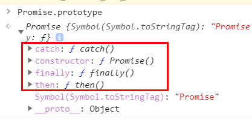

#Promise

```javascript
function getList(bool) {
    return new Promise((resolve,reject) => {
        if(bool) {
            setTimeout(() => {
                resolve('getlist success')
            }, 3000);
        } else {
            reject('getlist error')
        }
    })
}

getList(false).then(res => {
    console.log('res:',res);
    
}).catch(err => {
    console.log('err:',err)
})
```

上面这个是最常规的Promise使用形式

```javascript
new Promise( function(resolve, reject) {...} /* executor */  );
```

executor是带有 resolve 和 reject 两个参数的函数 。

Promise构造函数执行时立即调用executor 函数， resolve 和 reject 两个函数作为参数传递给executor（executor 函数在Promise构造函数返回所建promise实例对象前被调用）

resolve被调用时，把promise的状态改为fulfilled。

reject被调用时，把promise的状态改为rejected。


executor 内部通常会执行一些异步操作，一旦异步操作执行完毕(可能成功/失败)，要么调用resolve函数来将promise状态改成fulfilled，要么调用reject 函数将promise的状态改为rejected。如果在executor函数中抛出一个错误，那么该promise 状态为rejected。

executor函数的返回值被忽略。

## then方法
```javascript
function getList2(bool) {
    return new Promise((resolve, reject) => {
        if (bool) {
            setTimeout(() => {
                resolve('getlis2t success')
            }, 3000);
        } else {
            reject('getlist2 error')
        }
    })
}

getList2(false).then(res => {
    console.log('res:', res);
}, err => {
    console.log('err:', err)
})
```
Promise 对象的 then 方法绑定的处理方法（handlers ）就会被调用（then方法包含两个参数：onfulfilled 和 onrejected，它们都是 Function 类型。当Promise状态为fulfilled时，调用 then 的 onfulfilled 方法，当Promise状态为rejected时，调用 then 的 onrejected 方法。




then方法在Promise.prototype上定义。