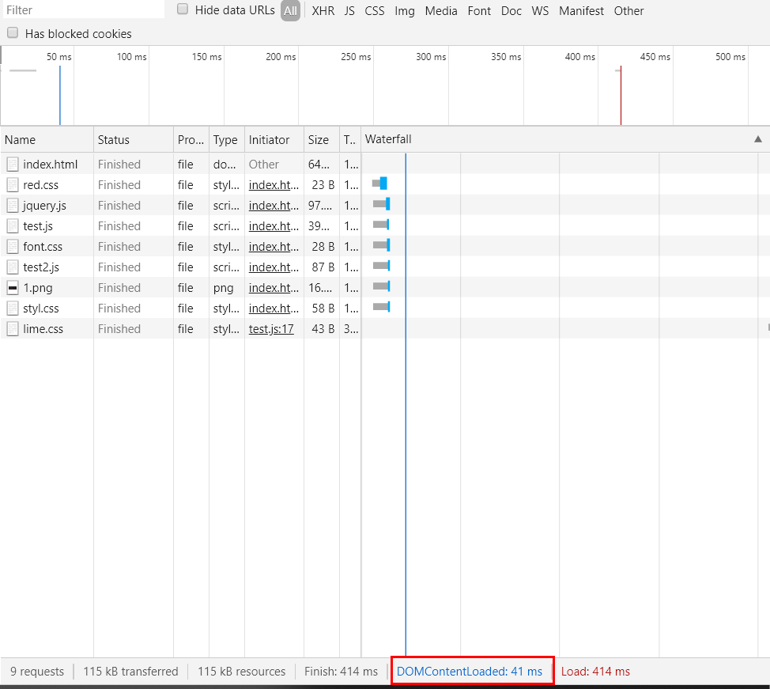
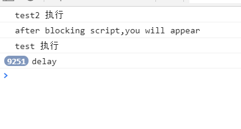

# html执行顺序

## 资源下载不会被阻塞

图中可以看出link标签和script标签的下载不会被阻塞，这是因为浏览器的下载线程和GUI线程不冲突，所以渲染和下载也是不冲突的。

## JS执行会阻塞渲染

图中有两根线，一蓝一红，蓝色线代表DOMcontentLoaded触发的时间，也就是DOM被解析完成，页面从空白到有了DOM结构的时间。蓝色是load事件的触发时间，页面上所有的资源（样式，图片，音频，视频等）被加载以后才会触发load事件。

因为test.js有一段内容执行时间较长：
```javascript
for(var i=0;i<10000;i++){
    console.log("delay");
    if(i==9999){
        loadStyle('lime.css');
    }
}
```

所以DOMcontentLoaded触发的时间也比较晚，如果我们把这一段内容注释掉的话


可以很明显的看出DOMcontentLoaded触发的时间从335ms变为30ms，可见，js脚本的执行会阻塞页面的渲染。这是因为JS引擎线程和GUI渲染线程是互斥的，当JS引擎执行时GUI线程会被挂起（相当于被冻 结了），GUI更新会被保存在一个队列中等到JS引擎空闲时立即被执行。

这样一来，把JS放在最后面，把CSS放在前面是有道理的，因为这样网页可以以最快的速度渲染出一个框架，不至于被长时间的JS执行阻塞而导致页面上什么都没有。

## 改变js执行顺序


这张图是HTML的规范，在加载外链js时，为了使js执行不阻塞页面渲染，可以使用async或者defer标签，使js先下载完，等到html渲染完再执行。

比方说，在chrome里：

```html
    <script type="text/javascript" src="test.js"></script>
```
由于test.js里有一个耗时的代码需要执行，所以DOMcontentLoaded触发的时间为394ms。


但是如果给script标签加上了async属性
```html
    <script type="text/javascript" src="test.js" async></script>
```

可以看到DOMcontentLoaded触发的时间变为了41ms。



不加async或defer的情况下：
```html
    <script type="text/javascript" src="test.js" ></script>
    <link rel="stylesheet" href="font.css">
    <script type="text/javascript" src="test2.js" ></script>
```
会先执行test.js再执行test2.js


如果给test.js加上defer或async:

```html
    <script type="text/javascript" src="test.js" defer></script>
    <link rel="stylesheet" href="font.css">
    <script type="text/javascript" src="test2.js" ></script>
```
那么test就会被延迟执行

