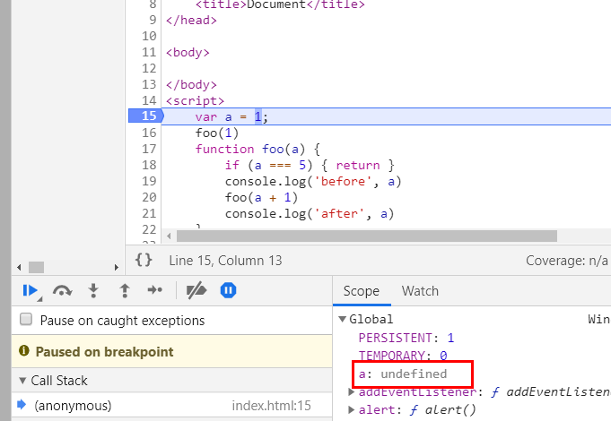
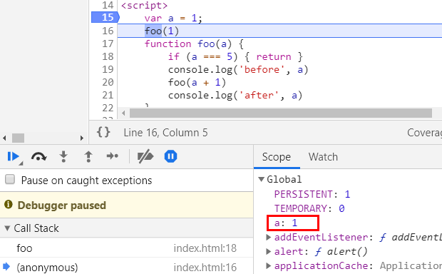

```javascript
    var a = 1;
    foo(1)
    function foo(a) {
        if (a === 5) { return }
        console.log('before', a)
        foo(a + 1)
        console.log('after', a)
    }
    console.log('end', a)
```

答案是：


js里函数声明和变量声明都会被提升，函数声明提升到变量声明前，所以以上代码实际上是这样：
```javascript
    //函数声明被提升
    function foo(a) {
        if (a === 5) { return }
        console.log('before', a)
        foo(a + 1)
        console.log('after', a)
    }
    //变量声明被提升
    var a
    //赋值操作
    a = 1
    
    foo(1)
    
    console.log('end', a)
```

前面都风平浪静，没有发生什么，只有一开始在全局声明了一个变量a和一个函数foo



接着变量a被赋值，变为1


重要的部分来了，遇到foo(1)这一行，执行栈里被推进了一个新的东西，也就是创建一个新的函数执行上下文，里面包含一个值为1的参数a。


进入函数体内部，进行判断，a === 5的条件没达成，所以输出
    
    before 1

然后进入到下一行foo(a+1),这时又会创建一个新的函数执行上下文


以此类推，调用栈中总共被推入5个foo函数的执行上下文，依次执行打印
    before 2
    before 3
    before 4


直到a === 5时，函数结束执行，开始出栈，也就是把执行上下文从栈顶移除：


上一个foo的执行上下文被移除时，就可以继续进行到之前的代码体中，所以依次执行打印
    
    after 4
    after 3
    after 2
    after 1

最后结束，打印window中的a变量1


